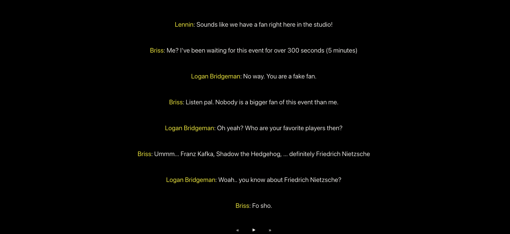

# Telimpromptu

\
Telimpromptu is a free online game where players create and present whacky mad-libs style news broadcasts. Games can currently support 3-8 players, and can be played either online or in-person.

## How to Play

Go to https://telimpromptu.net to play 

## Contributing

Pull requests are welcome. 

## License

[MIT](https://choosealicense.com/licenses/mit/)